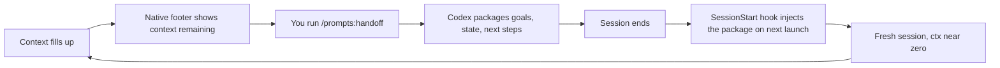

# overcodex

[](https://pypi.org/project/overcodex/)
[](LICENSE)


**Codex CLI, overclocked.** Cold-switch between Codex accounts, hand off to a fresh session with `/prompts:handoff` before context fills up, watch usage on the statusline, and route multi-agent work with an AGENTS.md policy:

```text
codex-swap work         # register/list accounts, then switch — restart required
/prompts:handoff        # package this session's state, resume fresh next launch

native footer: model with reasoning | current directory | project name | context remaining | 5h limit | weekly limit
```

## Install

```bash
pipx install overcodex && overcodex install
```

> **Fresh machine?** If you get `command not found: overcodex`, pipx's bin folder isn't on your PATH yet — run `pipx ensurepath && source ~/.zshrc`, then `overcodex install`. (Use `source`, not `exec zsh`: replacing the shell swallows any commands you pasted after it.)

Then register your accounts (once, per account):

```bash
codex-swap add work        # creates an isolated account home + links shared config
codex-swap add personal    # then log in to each: CODEX_HOME=~/.codex-accounts/work codex login
codex-swap work             # cold switch: writes auth.json, then restart codex
```

Start a **new** Codex CLI session (hooks and AGENTS.md load at session start) and confirm its native footer shows the configured fields; Codex may omit unavailable usage-limit fields. Run `/prompts:handoff` inside Codex to hand off before you hit auto-compact.

The same routing policy is packaged as a portable skill for OpenClaw. Install it from a packaged overcodex build with `openclaw skills install "$(overcodex skill-path)" --global`, then configure the four role agent IDs described in `skill/overcodex-ultracode/references/openclaw-adapter.md`.

For agent-assisted setup, tell OpenClaw:

> Install and activate Overcodex UltraCode. Run `curl -fsSL https://raw.githubusercontent.com/arthur-bump-pm/overcodex/main/install-openclaw.sh | bash`, verify it with `openclaw skills list` and `openclaw agents list`, then configure the scout, worker, reviewer, and judge roles. Do not change credentials or existing agent settings without showing me the proposed diff first.

<details>
<summary>Other install methods, requirements, upgrading</summary>

```bash
# uv
uv tool install overcodex && overcodex install

# from source
git clone https://github.com/arthur-bump-pm/overcodex && cd overcodex && ./install.sh
```

Or paste this into any Codex CLI session and let it install itself:

> Install overcodex (https://github.com/arthur-bump-pm/overcodex) on this machine, fix anything its preflight complains about, and tell me what post-install steps I need to do myself.

**Requirements:** macOS, zsh, `pipx` or `uv`, a Codex CLI install (`codex --version`). No keychain daemon and no background credential engine — cold switching is just isolated `$CODEX_HOME` directories, one per account.

**Upgrade:** `pipx upgrade overcodex && overcodex install`

**Uninstall:** `overcodex uninstall` — removes exactly what install added (backed up); each account's isolated `$CODEX_HOME` copy survives untouched.

The installer is idempotent and conservative: timestamped backups of everything it touches, additive edits to `config.toml` (never overwrites an existing `hooks` or `status_line` key), re-running is a no-op.

</details>

## What you get

### `codex-swap` — cold account switching
Each account gets its own isolated `CODEX_HOME` (a separate `auth.json`, never a copied/overwritten one — refresh tokens can be single-use across copies, so isolation is the only safe design). `codex-swap <account>` points the shell at that directory and tells you to restart. **This is a cold switch**: any Codex session already running keeps its old credentials until you quit and relaunch it. There is no hot mid-session swap here — if you need that, it's overclaude's `/swap` for Claude Code, not this.

### `/prompts:handoff` — escape context bloat, keep the thread



You lose the token bloat, not the thread. Combine with a `codex-swap` restart when you're also switching accounts.

### Statusline
The kit ships conservative defaults for Codex's native footer, in this order: `model-with-reasoning`, `current-dir`, `project-name`, `context-remaining`, `five-hour-limit`, and `weekly-limit`, with colors enabled. Codex renders these native fields and may omit usage-limit fields that are unavailable. Installation adds the defaults only when you do not already have `tui.status_line`; an existing user setting is preserved. Start a new Codex CLI session after installation for the footer to reload.

OverCodex hooks use rollout data separately to issue handoff warnings as context fills. They cannot inject a custom statusline command or replace Codex's native footer.

### AGENTS.md routing policy + custom agents
A policy block appended to `$CODEX_HOME/AGENTS.md` (loaded globally, then project `AGENTS.md` files concatenate root-down) tells Codex when to delegate and enforces read-parallel/write-serial coordination, verification floors, escalation, and final synthesis. Four custom-agent definitions under `$CODEX_HOME/agents/`, registered in `[agents]`, pin bulk scouting to Luna, implementation to Terra, review to Sol/high, and adjudication to Sol/xhigh. Routed dispatches use an explicit `agent_type` and `fork_turns = "none"`; a task name alone does not route models.

For an explicit trigger inside Codex, run `/prompts:ultracode` and include the objective. For qualifying complex tasks, the global policy also defaults to delegation and requires the parent to explain any decision to stay serial.

When Codex opens this GitHub checkout, the root `AGENTS.md` supplies the repository-local instruction layer. Prompt it with `Activate Overcodex UltraCode in this repository` to have it inspect the global marker and run `./install.sh` when activation is requested. For OpenClaw, prompt it to run `./install-openclaw.sh`; the portable `SKILL.md` then supplies the same orchestration policy.

The detailed agent-facing activation contract is in [`AGENT-SETUP.md`](AGENT-SETUP.md). Short prompts are enough because the repository's `AGENTS.md` directs the agent to read that contract:

**Codex:** `Activate Overcodex UltraCode for Codex from https://github.com/arthur-bump-pm/overcodex. Clone it if needed, follow AGENT-SETUP.md, preserve unrelated settings, verify the roles and smoke test, then report the restart step.`

**OpenClaw:** `Activate Overcodex UltraCode for OpenClaw from https://github.com/arthur-bump-pm/overcodex. Clone it if needed, follow AGENT-SETUP.md, show configuration diffs before applying them, verify the skill and agents, then run a harmless scout check.`

The complete copy-paste versions are in [`overcodex-instructions.md`](overcodex-instructions.md).

For full proactive orchestration, select a supported Codex reasoning effort in the model controls. GPT-5.5 supports `none`, `low`, `medium`, `high`, and `xhigh`; GPT-5.6 Sol/Terra/Luna also support `max`. The bundled judge uses portable `xhigh`; use `max` only for a GPT-5.6 quality-critical adjudication. `ultra` is not a Codex effort value. Installing Overcodex does not silently replace your existing model or effort preference.

### Hooks + prompts
`SessionStart`/`UserPromptSubmit`/`Stop`/`PreCompact` hooks wired via an inline `[hooks]` table in `config.toml`, plus `/prompts:*` markdown prompts under `$CODEX_HOME/prompts/` (YAML frontmatter, `$1`-`$9` placeholders) for the handoff flow and other repeatable operations.

## Cheat sheet

| Command | Effect |
|---|---|
| `codex-swap add <name>` | Create an isolated home under `~/.codex-accounts/<name>` and link shared config; log in to it with the printed `CODEX_HOME=... codex login` |
| `codex-swap <name>` | Point `$CODEX_HOME` at that account's isolated store — **restart codex after** |
| `codex-swap list` | Show registered accounts and which is active |
| `/prompts:handoff` | Package this session's state; auto-injected on next launch |
| `overcodex install` | (Re)install/refresh the kit — idempotent |
| `overcodex uninstall` | Remove exactly what install added |
| `overcodex path` | Print the bundled payload directory |
| `overcodex skill-path` | Print the portable OpenClaw/Codex skill directory |
| `install-openclaw.sh` | Install the packaged skill into OpenClaw |

Or skip memorizing and **paste a prompt**:

| Paste into Codex CLI | Runs |
|---|---|
| "Hand off — context is filling up" | `/prompts:handoff` |
| "Switch me to my work account" | walks you through `codex-swap work` + the restart |
| "Install overcodex on this machine" | the whole install flow (works before the kit exists) |
| "Upgrade overcodex and refresh the hooks" | `pipx upgrade overcodex && overcodex install` |

## How it fits together

```mermaid
flowchart TD
    AH[AGENTS.md routing policy] --> HK[config.toml hooks table: SessionStart/UserPromptSubmit/Stop]
    HK --> PR[/prompts:handoff and friends]
    PR --> CS[codex-swap: isolated CODEX_HOME per account]
    CS --> RS[Cold restart adopts the new account]
    SL[Native footer: context-remaining + available usage limits] --> PR
    HK --> RW[Hooks read rollout data for handoff warnings]
    RW --> PR
```

<details>
<summary>Caveats worth knowing</summary>

- **Cold switch only.** `codex-swap` changes which `$CODEX_HOME` the shell points at; a session already running keeps reading its original `auth.json` until you quit and relaunch. There is no live/hot swap in this kit.
- **Refresh-token isolation is the whole point.** Codex's refresh tokens can be single-use across copies of the same credential (open upstream bug reports) — so accounts are never file-swapped or symlinked into a shared `auth.json`. Each account's `CODEX_HOME` refreshes its own token in place, permanently separate from the others.
- **Hooks run arbitrary shell on your events.** Review `hooks/*.sh` before installing on a machine you don't fully trust, same as any hook-based tool.
- **Sessions are sqlite, not JSONL.** `experimental_thread_store` keeps history in `sqlite_home` (e.g. `logs_2.sqlite`) — `codex resume --last` / `codex resume <id>` read from there, not from plain log files.
- Enterprise configs can set `allow_managed_hooks_only`, which blocks this kit's hooks from installing — check that first if hooks don't seem to load.

</details>

<details>
<summary>Components (file → destination)</summary>

| File | Installs to | Role |
|---|---|---|
| `bin/codex-swap` | `~/.local/bin/` | Cold account switcher: register, list, point `$CODEX_HOME` at an account |
| `hooks/*.sh` | `$CODEX_HOME/hooks/` | SessionStart / UserPromptSubmit / Stop handlers |
| `config/hooks-block.toml.tpl` | inline `[hooks]` table appended to `config.toml` (markers) | Hook wiring — only if no `hooks` key exists |
| `config/agents-block.toml.tpl` | `[agents]` block appended to `config.toml` (markers) | Registers the four routed roles |
| `codex/AGENTS-ULTRACODE.md` | appended to `$CODEX_HOME/AGENTS.md` (markers) | Model/effort routing policy |
| `prompts/*.md` | `$CODEX_HOME/prompts/` | `/prompts:*` custom prompts (handoff, etc.) |
| `agents/*.toml` | `$CODEX_HOME/agents/` | Pinned Luna/Terra/Sol custom subagent roles |
| `skill/overcodex-ultracode/` | OpenClaw skill root (or packaged payload) | Portable policy, role prompts, and platform adapters |

| `shell/zshrc-snippet.sh` | `~/.zshrc` (markers) | `codex-swap` PATH/alias wiring |

</details>

<details>
<summary>Maintainer workflow</summary>

```bash
./tests/smoke.sh     # isolated install/hooks/reinstall/uninstall verification
./sync.sh            # live setup -> repo: scrub-gated diff, commit, push
./sync.sh --release  # + version bump + GitHub release -> PyPI (trusted publishing)
./sync.sh --dry-run  # preview either
```

A plain `git push` updates git installs only — **PyPI users get changes only via releases**. The scrub gate aborts any commit whose diff contains usernames, emails, or `/Users/…` paths. See `CLAUDE.md` for the full protocol.

</details>

## Credits

overcodex is the Codex CLI sibling of **[overclaude](https://github.com/arthur-bump-pm/overclaude)** (same author, same packaging shape) — overclaude does hot account swapping for Claude Code; Codex CLI's credential model only allows a cold switch, so this kit is built around that constraint instead of hiding it.

### Hot-swap and the codext fork

True hot account switching exists on Codex only via [codext](https://github.com/Loongphy/codext) — an Apache-2.0 hard fork of the Codex CLI that polls `auth.json` and reloads it in-process at idle turn boundaries (verified in its source: `tui/src/auth_watch.rs`, `login/src/auth/manager.rs`). It works, with two trade-offs `codex-swap` deliberately doesn't make: it requires running a single-maintainer fork that rebases onto each upstream release, and it still doesn't solve cross-copy refresh-token rotation — switching back to an account whose token rotated elsewhere can force a re-login (codext issue #1 confirms). `codex-swap` stays cold-but-bulletproof by isolating accounts in separate `CODEX_HOME`s where tokens never move. If OpenAI ships auth live-reload upstream, `codex-swap` grows hot for free.

## License

MIT — see [LICENSE](LICENSE).
