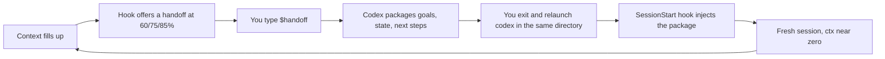
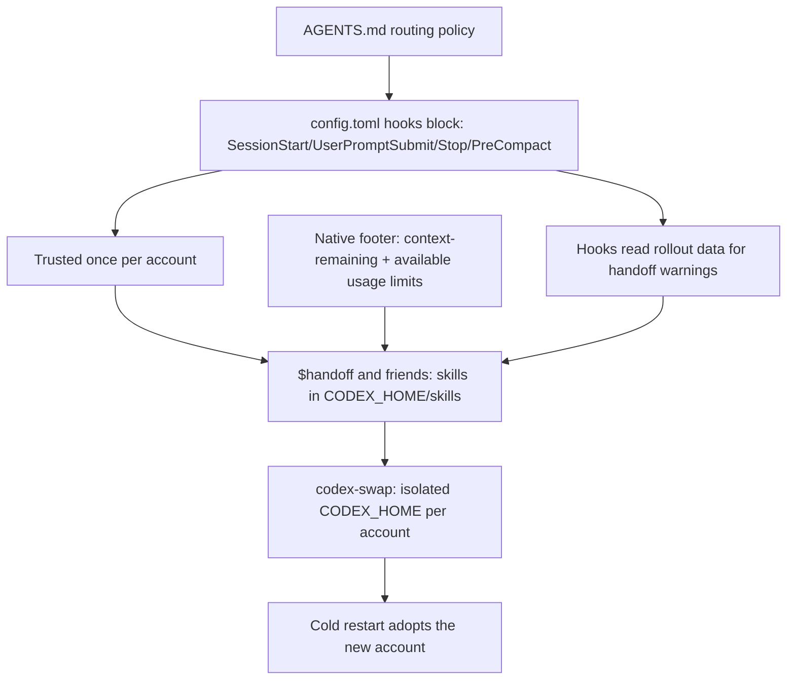

# overcodex

[](https://pypi.org/project/overcodex/)
[](LICENSE)


**Codex CLI, overclocked.** Cold-switch between Codex accounts, hand off to a fresh session with the `$handoff` skill before context fills up, watch usage on the native footer, and route multi-agent work with an AGENTS.md policy:

```text
codex-swap use work     # register/list accounts, then switch — restart required
$handoff                # (inside Codex) package this session, resume fresh next launch

native footer: model with reasoning | current directory | project name | context remaining | 5h limit | weekly limit
```

## Install

```bash
pipx install overcodex && overcodex install
```

> **Fresh machine?** If you get `command not found: overcodex`, pipx's bin folder isn't on your PATH yet — run `pipx ensurepath && source ~/.zshrc`, then `overcodex install`. (Use `source`, not `exec zsh`: replacing the shell swallows any commands you pasted after it.)

Then register your accounts (once, per account):

```bash
codex-swap add work        # creates an isolated account home + links shared config, skills, hooks
codex-swap add personal    # then log in to each: CODEX_HOME=~/.codex-accounts/work codex login
codex-swap use work        # cold switch: only writes the ~/.codex-accounts/.active marker
                           # (shorthand: codex-swap work) — then start a new codex
```

### One manual step: trust the hooks (once per account)

Codex runs a hook only after you trust it. Start a **new** Codex session; when Codex shows **"Hooks need review"**, choose **"Trust all and continue"** (or inspect them first with `/hooks`). Codex keys that trust by config path (`<config path>:<event>:<group>:<handler>`, path not canonicalized), so every codex-swap account — `~/.codex-accounts/<name>/config.toml` is a different path even though it is a symlink to the shared file — asks once on its own. Any change to a hook's definition (an upgrade that changes the hooks block says so) asks again. `overcodex doctor` lists each account's hook trust status.

Then confirm the native footer shows the configured fields (Codex may omit unavailable usage-limit fields), and type `$handoff` inside Codex to hand off before you hit auto-compact.

The same routing policy is packaged as a portable skill for OpenClaw. Install it from a packaged overcodex build with `openclaw skills install "$(overcodex skill-path)" --global`, then configure the four role agent IDs described in `skill/overcodex-ultracode/references/openclaw-adapter.md`.

For agent-assisted setup, tell OpenClaw:

> Install and activate Overcodex UltraCode. Run `curl -fsSL https://raw.githubusercontent.com/arthur-bump-pm/overcodex/main/install-openclaw.sh | bash`, verify it with `openclaw skills list` and `openclaw agents list`, then configure the scout, worker, reviewer, and judge roles. Do not change credentials or existing agent settings without showing me the proposed diff first.

<details>
<summary>Other install methods, requirements, upgrading</summary>

```bash
# uv
uv tool install overcodex && overcodex install

# from source
git clone https://github.com/arthur-bump-pm/overcodex && cd overcodex && ./install.sh
```

Or paste this into any Codex CLI session and let it install itself:

> Install overcodex (https://github.com/arthur-bump-pm/overcodex) on this machine, fix anything its preflight complains about, and tell me what post-install steps I need to do myself.

**Requirements:** macOS, zsh, `pipx` or `uv`, Codex CLI 0.158+ (`codex --version`), `jq`. `config.toml` is only edited after a TOML validity check: `overcodex install` brings its own parser; a bare `./install.sh` needs `python3` ≥ 3.11 (or `tomli`) and otherwise leaves `config.toml` untouched and says so. No keychain daemon and no background credential engine — cold switching is just isolated `$CODEX_HOME` directories, one per account.

**Upgrade:** `pipx upgrade overcodex && overcodex install` — then re-trust the hooks in each account if the installer says they changed.

**Uninstall:** `overcodex uninstall` — removes exactly what install added (backed up), including the shared-config links `codex-swap add` created in each account; each account's `auth.json` and session state survive untouched.

The installer is idempotent and conservative: timestamped backups of everything it touches; a user's own `hooks`, `[agents]` or `status_line` settings are never overwritten; overcodex's own marker blocks are refreshed when the shipped content changes; re-running is a no-op. Codex's config writer puts the tables it adds (hook trust records, `[notice]`, `[features]`, …) inside the nearest overcodex block — install and uninstall move those below the block instead of deleting them, and a sentinel `[hooks.state]` table after the hooks block makes Codex append below it in the first place.

</details>

## What you get

### `codex-swap` — cold account switching
Each account gets its own isolated `CODEX_HOME` (a separate `auth.json`, never a copied/overwritten one — refresh tokens can be single-use across copies, so isolation is the only safe design). `codex-swap use <account>` only records which account is active (`~/.codex-accounts/.active`); the `codex()` shell wrapper passes that account's home to each new `codex` process (`CODEX_HOME=… command codex`, never exported into your shell, and your own `CODEX_HOME` is left alone when no account is active). **This is a cold switch**: any Codex session already running keeps its old credentials until you quit and relaunch it. There is no hot mid-session swap here — if you need that, it's overclaude's `/swap` for Claude Code, not this.

### `$handoff` — escape context bloat, keep the thread

Codex 0.158 removed `/prompts:*` custom prompts, so the handoff flow ships as **Codex skills** in `$CODEX_HOME/skills/` (shared into every codex-swap account). Invoke one by typing its `$` mention anywhere in your message — `$handoff`, or `$handoff now please` — or browse them with `/skills`.


```mermaid
flowchart LR
    A[Context fills up] --> B[Hook offers a handoff at 60/75/85%]
    B --> C[You type $handoff]
    C --> D[Codex packages goals, state, next steps]
    D --> E[You exit and relaunch codex in the same directory]
    E --> F[SessionStart hook injects the package]
    F --> G[Fresh session, ctx near zero]
    G --> A
```

You lose the token bloat, not the thread. The package format (header line, 12-hex sha256-of-cwd file name, 10-minute window) is byte-compatible with [overclaude](https://github.com/arthur-bump-pm/overclaude): `$handoff-claude` hands the work to Claude Code, and overclaude's `/handoff codex` hands it back. Combine with `codex-swap use <name>` before relaunching when you're also switching accounts.

### Statusline
The kit ships conservative defaults for Codex's native footer, in this order: `model-with-reasoning`, `current-dir`, `project-name`, `context-remaining`, `five-hour-limit`, and `weekly-limit`, with colors enabled. Codex renders these native fields and may omit usage-limit fields that are unavailable. Installation adds the defaults only when you do not already have `tui.status_line`; an existing user setting is preserved (an inline `tui = { … }` table is left alone with a warning). Start a new Codex CLI session after installation for the footer to reload.

OverCodex hooks use rollout data separately to issue handoff warnings as context fills. They cannot inject a custom statusline command or replace Codex's native footer.

### AGENTS.md routing policy + custom agents
A policy block appended to `$CODEX_HOME/AGENTS.md` (loaded globally, then project `AGENTS.md` files concatenate root-down) tells Codex when to delegate and enforces read-parallel/write-serial coordination, verification floors, escalation, and final synthesis. Four custom-agent definitions under `$CODEX_HOME/agents/`, registered in `[agents]`, pin bulk scouting to Luna, implementation to Terra, review to Sol/high, and adjudication to Sol/xhigh. Routed dispatches use an explicit `agent_type` and `fork_turns = "none"`; a task name alone does not route models.

For an explicit trigger inside Codex, type `$ultracode` followed by the objective. For qualifying complex tasks, the global policy also defaults to delegation and requires the parent to explain any decision to stay serial.

When Codex opens this GitHub checkout, the root `AGENTS.md` supplies the repository-local instruction layer. Prompt it with `Activate Overcodex UltraCode in this repository` to have it inspect the global marker and run `./install.sh` when activation is requested. For OpenClaw, prompt it to run `./install-openclaw.sh`; the portable `SKILL.md` then supplies the same orchestration policy.

The detailed agent-facing activation contract is in [`AGENT-SETUP.md`](AGENT-SETUP.md). Short prompts are enough because the repository's `AGENTS.md` directs the agent to read that contract:

**Codex:** `Activate Overcodex UltraCode for Codex from https://github.com/arthur-bump-pm/overcodex. Clone it if needed, follow AGENT-SETUP.md, preserve unrelated settings, verify the roles and the test suite, then report the restart and hook-trust steps.`

**OpenClaw:** `Activate Overcodex UltraCode for OpenClaw from https://github.com/arthur-bump-pm/overcodex. Clone it if needed, follow AGENT-SETUP.md, show configuration diffs before applying them, verify the skill and agents, then run a harmless scout check.`

The complete copy-paste versions are in [`overcodex-instructions.md`](overcodex-instructions.md).

**Models and reasoning effort.** Codex's model catalog (as of Codex 0.158) defaults to `gpt-6-astra`. Every listed model accepts `low`, `medium`, `high`, and `xhigh`; `max` is also available on GPT-6 Astra/Sol/Luna and GPT-5.6 Sol/Terra/Luna; `ultra` only on `gpt-6-astra`, `gpt-6-sol`, `gpt-5.6-sol`, and `gpt-5.6-terra` (not on Luna models; the legacy `gpt-5.5` stops at `xhigh`). No model accepts none as an effort. The bundled judge uses the portable `xhigh`; reserve `max`/`ultra` for a quality-critical adjudication on a model that lists it. Installing overcodex does not replace your existing model or effort preference.

### Hooks + skills
`SessionStart` (`matcher = "startup"`, `additionalContextLimit = 8000` so a handoff package is not spilled/middle-truncated) / `UserPromptSubmit` / `Stop` / `PreCompact` hooks, wired via a marker-wrapped `[hooks]` block at the end of `config.toml`, plus five skills under `$CODEX_HOME/skills/<name>/SKILL.md` for the handoff flow and explicit multi-agent runs.

## Cheat sheet

| Command | Effect |
|---|---|
| `codex-swap add <name>` | Create an isolated home under `~/.codex-accounts/<name>`, link shared config/skills/hooks, print the login + hook-trust steps |
| `codex-swap use <name\|primary>` | Write the active-account marker (cold switch) — **restart codex after** |
| `codex-swap <name>` | Shorthand for `codex-swap use <name>` |
| `codex-swap which` | Print the active account and its `CODEX_HOME` (a marker naming a deleted account falls back to primary) |
| `codex-swap list` | Show registered accounts, login state, and which is active |
| `codex-swap list --json` | The same as JSON (`name`, `codexHome`, `active`, `loggedIn`) |
| `codex-swap remove <name> [--yes]` | Delete an account's directory (never primary); resets the marker if it was active |
| `codex-swap path handoff [--cwd D]` | Print this directory's pending-handoff file (also where overclaude's `/handoff codex` writes) |
| `$handoff` | (in Codex) Package this session; auto-injected on the next launch in this directory |
| `$handoff-status` | (in Codex) Show whether a package is pending here and how old it is |
| `$handoff-cancel` | (in Codex) Remove this directory's pending package |
| `$handoff-claude` | (in Codex) Hand this work to Claude Code: writes the package overclaude's SessionStart hook loads (needs overclaude) |
| `$ultracode <objective>` | (in Codex) Explicit multi-agent run with the routed roles |
| `/skills`, `/hooks` | (in Codex) Browse skills; review/trust hooks |
| `overcodex install` | (Re)install/refresh the kit — idempotent |
| `overcodex uninstall` | Remove exactly what install added |
| `overcodex doctor` | Per-account hook trust + skill check (runs `codex app-server`, no model calls) |
| `overcodex path` | Print the bundled payload directory |
| `overcodex skill-path` | Print the portable OpenClaw/Codex skill directory |
| `install-openclaw.sh` | Install the packaged skill into OpenClaw |

Or skip memorizing and **paste a prompt**:

| Paste into Codex CLI | Runs |
|---|---|
| "Hand off — context is filling up" | the `$handoff` skill (after you confirm) |
| "Switch me to my work account" | walks you through `codex-swap use work` + the restart |
| "Install overcodex on this machine" | the whole install flow (works before the kit exists) |
| "Upgrade overcodex and refresh the hooks" | `pipx upgrade overcodex && overcodex install` |

## How it fits together


```mermaid
flowchart TD
    AH[AGENTS.md routing policy] --> HK[config.toml hooks block: SessionStart/UserPromptSubmit/Stop/PreCompact]
    HK --> TR[Trusted once per account]
    TR --> SK[$handoff and friends: skills in CODEX_HOME/skills]
    SK --> CS[codex-swap: isolated CODEX_HOME per account]
    CS --> RS[Cold restart adopts the new account]
    SL[Native footer: context-remaining + available usage limits] --> SK
    HK --> RW[Hooks read rollout data for handoff warnings]
    RW --> SK
```

<details>
<summary>Caveats worth knowing</summary>

- **Cold switch only.** `codex-swap` changes which `$CODEX_HOME` new `codex` processes get; a session already running keeps reading its original `auth.json` until you quit and relaunch. There is no live/hot swap in this kit.
- **Refresh-token isolation is the whole point.** Codex's refresh tokens can be single-use across copies of the same credential (open upstream bug reports) — so accounts are never file-swapped or symlinked into a shared `auth.json`. Each account's `CODEX_HOME` refreshes its own token in place, permanently separate from the others.
- **Hooks need trust, per account.** Untrusted or modified hooks simply do not run (no handoff injection, no context warnings). See "trust the hooks" above; `overcodex doctor` shows where trust is missing.
- **Hooks run arbitrary shell on your events.** Review `hooks/*.sh` before trusting them on a machine you don't fully trust, same as any hook-based tool.
- **Sessions are rollout JSONL files.** Each session is `$CODEX_HOME/sessions/YYYY/MM/DD/rollout-<timestamp>-<thread-id>.jsonl` (with a sqlite index alongside); `codex resume --last` / `codex resume <id>` read from there. The context-watch hooks read the latest `token_count` event from that file.
- Enterprise configs can set `allow_managed_hooks_only`, which stops this kit's (user-level) hooks from **running** — only managed hooks run. Check that first if the hooks never fire.

</details>

<details>
<summary>Components (file → destination)</summary>

| File | Installs to | Role |
|---|---|---|
| `bin/codex-swap` | `~/.local/bin/` | Cold account switcher: register, list, switch, `path handoff` |
| `hooks/*.sh` | `$CODEX_HOME/hooks/` | SessionStart / UserPromptSubmit / Stop / PreCompact handlers |
| `skills/<name>/SKILL.md` | `$CODEX_HOME/skills/<name>/` | `$handoff`, `$handoff-status`, `$handoff-cancel`, `$handoff-claude`, `$ultracode` |
| `config/hooks-block.toml.tpl` | marker-wrapped hooks block at the end of `config.toml` | Hook wiring — skipped if you define your own hooks (Codex's `[hooks.state]` trust records don't count) |
| `config/agents-block.toml.tpl` | `[agents]` marker block in `config.toml` | Registers the four routed roles |
| `config/statusline.toml` | `[tui]` keys in `config.toml` (markers) | Native footer defaults — only if `status_line` is unset |
| `codex/AGENTS-ULTRACODE.md` | appended to `$CODEX_HOME/AGENTS.md` (markers) | Model/effort routing policy |
| `agents/*.toml` | `$CODEX_HOME/agents/` | Pinned Luna/Terra/Sol custom subagent roles |
| `lib/overcodex_config.py` | (runs from the payload) | Validated, marker-aware `config.toml` editor used by install/uninstall |
| `shell/zshrc-snippet.sh` | `~/.zshrc` (markers) | `codex()` account wrapper, `codex-swap` PATH/alias wiring |
| `skill/overcodex-ultracode/` | OpenClaw skill root (or packaged payload) | Portable policy, role prompts, and platform adapters |

</details>

<details>
<summary>Maintainer workflow</summary>

```bash
./tests/run.sh       # full suite in throwaway $HOMEs (also drives `codex app-server` when codex is installed)
./sync.sh            # live setup -> repo: scrub-gated diff, commit, push
./sync.sh --release  # + release gate (shellcheck + tests), version bump unless already ahead, GitHub release -> PyPI
./sync.sh --dry-run  # preview either
```

A plain `git push` updates git installs only — **PyPI users get changes only via releases**. The scrub gate (`scrub.sh`) aborts any commit whose diff or new untracked files contain usernames, emails, or `/Users/…` paths. See `CLAUDE.md` for the full protocol.

</details>

## Versions

| Version | Date | Status | Highlights |
|---|---|---|---|
| **0.3.0** | 2026-10-09 | ✅ released | Handoff flow ported to Codex 0.158 skills (`$handoff`, `$handoff-status`, `$handoff-cancel`, `$handoff-claude`, `$ultracode`); `codex-swap path handoff`; hook-trust guidance + `overcodex doctor`; config.toml edits validated and Codex-written tables preserved (no more data loss on uninstall/upgrade; user hooks, role overrides, file modes, CRLF and damaged markers handled safely); hooks block refreshes on upgrade; `additionalContextLimit` + `matcher = "startup"` for SessionStart; `codex()` wrapper no longer exports `CODEX_HOME`; release gate + CI; `sync.sh --dry-run` no longer writes |
| 0.2.0 | 2026-07-23 | released | Portable UltraCode orchestration (four routed agent roles, OpenClaw skill), native footer defaults |
| 0.1.1 | 2026-07-17 | released | Docs: codext hot-swap investigation |
| 0.1.0 | 2026-07-17 | released | Codex CLI port of overclaude: codex-swap, handoff, hooks, AGENTS.md routing |

## Credits

overcodex is the Codex CLI sibling of **[overclaude](https://github.com/arthur-bump-pm/overclaude)** (same author, same packaging shape) — overclaude does hot account swapping for Claude Code; Codex CLI's credential model only allows a cold switch, so this kit is built around that constraint instead of hiding it.

### Hot-swap and the codext fork

True hot account switching exists on Codex only via [codext](https://github.com/Loongphy/codext) — an Apache-2.0 hard fork of the Codex CLI that polls `auth.json` and reloads it in-process at idle turn boundaries (verified in its source: `tui/src/auth_watch.rs`, `login/src/auth/manager.rs`). It works, with two trade-offs `codex-swap` deliberately doesn't make: it requires running a single-maintainer fork that rebases onto each upstream release, and it still doesn't solve cross-copy refresh-token rotation — switching back to an account whose token rotated elsewhere can force a re-login (codext issue #1 confirms). `codex-swap` stays cold-but-bulletproof by isolating accounts in separate `CODEX_HOME`s where tokens never move. If OpenAI ships auth live-reload upstream, `codex-swap` grows hot for free.

## License

MIT — see [LICENSE](LICENSE).
